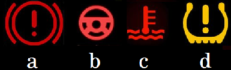

= Round 2 - Symbology 

====
Identify the meaning of each symbol you might run across in everyday life.
Each picture has 4 separate questions (a,b,c,d) for a total of 20 questions worth half a point each.

Possible Points: 10
====

'''

1. On a piece of clothing:
  * 

2. On a prescription medication:
  * 

3. On a sign near some hazardous materials:
  * 

    * (What does each section represent? You can ignore the numbers)
    a.	(Blue)
    b.	(Red)
    c.	(Yellow)
    d.	(bottom)

4. On your car’s dashboard:
  * 

5. On the ORD airport printable maps:
  * 

'''

link:../../../index.html[Click here to return to the main site]