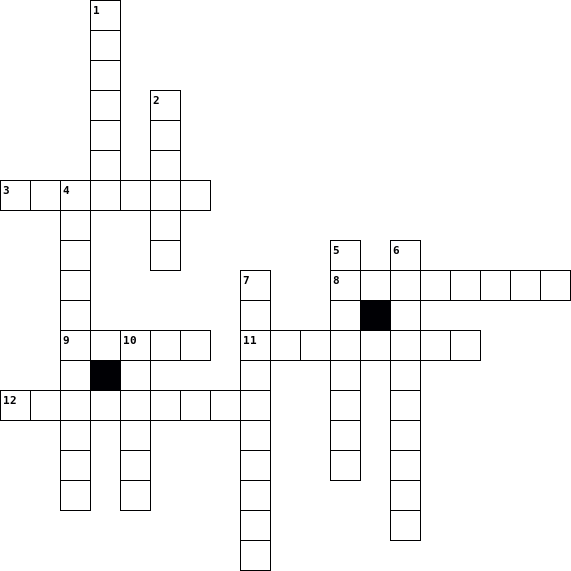

= Round 7 - Criss-Cross Applesauce 

====
Answer each question that fits into this crossword puzzle.  The answer must have the correct length and fit with the intersecting clues!

Possible Points: 12
====

'''

*Across*

* 3.	Common lasagna cheese

* 8.	Billy Mays pitched it

* 9.	Country bordering Mt Everest

* 11.	Trades as GME

* 12.	Bart Simpson's Teacher

*Down*

* 1.	Highest standard vocal range

* 2.	Your digital representation in The Oasis

* 4.	Largest national park in the state of Utah

* 5.	Greek god of the sea

* 6.	Standard length of a semi-trailer (ft)

* 7.	The evolution of Jigglypuff

* 10.	Capital of Czechia

'''

link:../../../index.html[Click here to return to the main site]