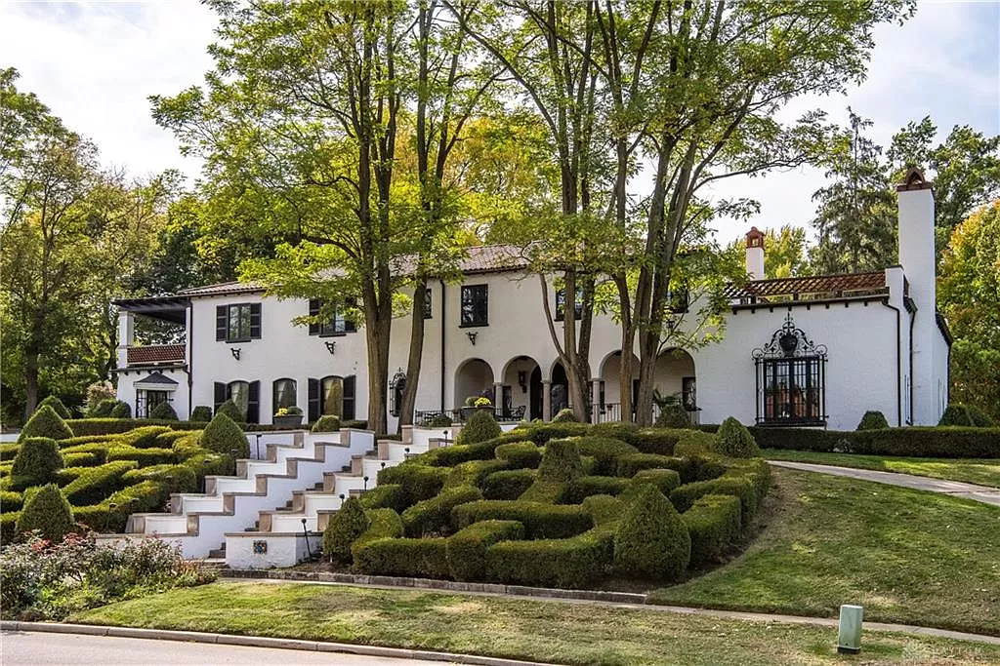

= Final Round - Bing It!

====
For this round only: feel free to google the answers, phone a friend, look around your house, whatever. Anything goes!

BONUS! The first team to submit their answers AND get at least 10/11 correct will get a bonus 2 points! Be quick, but be right!

Possible Points: 11 (+2 potential bonus)
====

'''

1.	In the movie Office Space, what is the name of the woman answering the phone in the background of the opening scene?

2.	Among other things, this conglomerate owns large shares of many video game companies across the globe, including 40% of the company that created Fortnite.

3.	Name the only national flag not featuring the colors of red, white, OR blue.

4.	According the ingredient list on a can of Mountain Dew, what is the purpose of including Calcium Disodium Edta (verbatim)?

5.	In Johnny Cash’s version of I’ve Been Everywhere, how many unique US states does he name?

6.	What is the current name of the building that the Memphis Grizzlies played their first ever home game in?

7.	In Google Street View, what company’s van is parked in front of Becky & Noah’s current apartment building?

8.	In their only Super Bowl win, who was the leading rusher for the Seattle Seahawks?

9.	How many of the original 50 US State quarters feature a horse?

10.	In the original music video for Rick Astley's Never Gonna Give You Up, how many different outfits does Astley wear?

11.	 What city can you find this house in?
    * 

'''

link:../../../index.html[Click here to return to the main site]