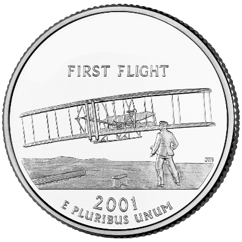
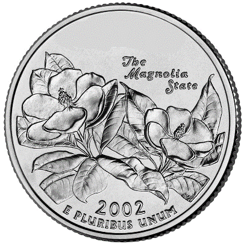

= Round 1 Answers - Dolla Dolla Bill Ya’ll 

====
Answers
====

'''

1.	Who can be found on front of the US $50 bill?
    a. Answer: *Ulysses S Grant*

2.	If you had one of each currently printed paper bill, how much money would you have? (US)
    a. Answer: *$188* (1 + 2 + 5 + 10 + 20 + 50 + 100)

3.	Google acquired what smart-home device maker for $3.2 Billion dollars only 4 years after it was founded?
    a. Answer: *Nest*

4.	The buying power of $1 in 1950 is worth approximately what in 2020 dollars? (Multiple Choice)
    a.	$4.64
    b.	$6.29
    c.	$8.13
    d.	*$10.78* (Correct Answer)
  
5.	According to Forbes, who were the highest earning actor and actress of 2019? 
  (half a point each, counted from June 1, 2018 to June 1, 2019)
    a. Answer: *Dwayne "The Rock" Johnson* and *Scarlet Johansson*

  
  *For questions 6-10: Name the state represented by each quarter*

6. image:../../resources/quarters/quarter1.png[]
    a. Answer: *Oregon*

7. 
    a. Answer: *North Carolina*

8. 
    a. Answer: *Mississippi*

9. image:../../resources/quarters/quarter4.png[]
    a. Answer: *Delaware*

10. image:../../resources/quarters/quarter5.png[]
    a. Answer: *Florida*

'''

link:../../../index.html[Click here to return to the main site]