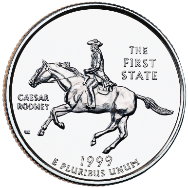

= Round 1 - Dolla Dolla Bill Ya’ll 

====
Answer the following questions about $$$

Possible Points: 10

Time Limit: 10 minutes
====

'''

1.	Who can be found on front of the US $50 bill?

2.	If you had one of each currently printed paper bill, how much money would you have? (US)

3.	Google acquired what smart-home device maker for $3.2 Billion dollars only 4 years after it was founded?

4.	The buying power of $1 in 1950 is worth approximately what in 2020 dollars? (Multiple Choice)
    a.	$4.64
    b.	$6.29
    c.	$8.13
    d.	$10.78
  
5.	According to Forbes, who were the highest earning actor and actress of 2019? 
  (half a point each, counted from June 1, 2018 to June 1, 2019)

  
  *For questions 6-10: Name the state represented by each quarter*

6. 

7. image:../../resources/quarters/quarter2.png[]

8. image:../../resources/quarters/quarter3.png[]

9. 

10. 

'''

link:../../../index.html[Click here to return to the main site]